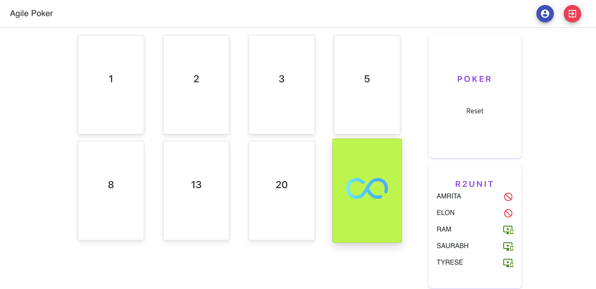

## agile-poker

<!--

-->

## Live
https://saurabhpro.github.io/agile-poker/
- just enter anything in login page
- and thats's it ;)

### Start

- npx create-react-app <app-name>
- rm App.js App.test.js App.css logo.svg

## how to add multiple scripts for npm

"postbuild": "(rm -rf agile-poker/_) & (mv build/_ agile-poker)"

## cards
- https://www.ordinarycoders.com/blog/article/codepen-bootstrap-card-hovers

## UI
- https://freefrontend.com/css-card-hover-effects/
- https://material-ui.com/getting-started/templates/

## firebase
- https://www.robinwieruch.de/complete-firebase-authentication-react-tutorial
- https://www.robinwieruch.de/firebase-tutorial
- https://css-tricks.com/building-a-real-time-chat-app-with-react-and-firebase/
- https://sebhastian.com/react-firebase-real-time-database-guide

## react
- https://itnext.io/add-state-and-lifecycle-methods-to-function-components-with-react-hooks-8e2bdc44d43d
- https://medium.com/@andrewmyint/infinite-loop-inside-useeffect-react-hooks-6748de62871

## jest
- https://jestjs.io/docs/en/expect

- https://devhints.io/
- https://blog.logrocket.com/react-router-hooks-will-make-your-component-cleaner/
- https://www.learnhowtoprogram.com/react-part-time-react-track/functional-programming-with-javascript/introduction-to-functional-programming
- https://blog.bitsrc.io/understanding-javascript-async-and-await-with-examples-a010b03926ea

## css 
- https://getflywheel.com/layout/flexbox-create-modern-card-design-layout/